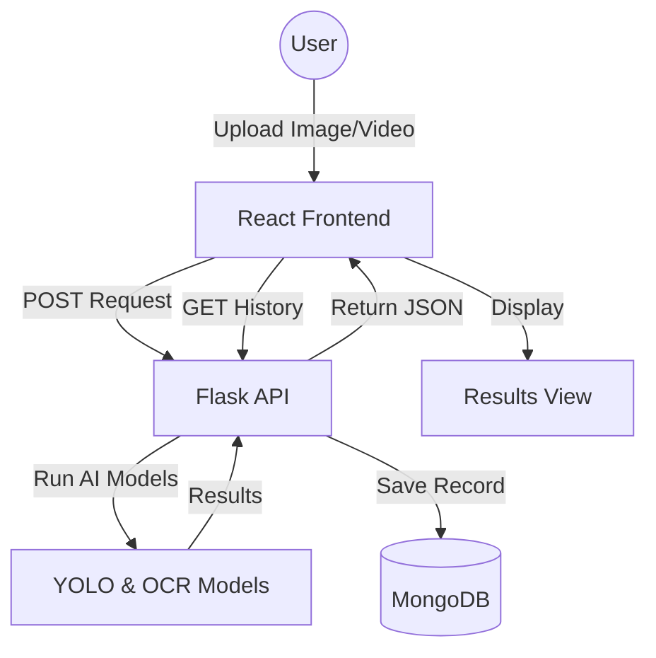

# Project Report: Automatic Number Plate Recognition System (ANPRS)

## 1. Introduction
The **Automatic Number Plate Recognition System (ANPRS)** is a modern AI-powered web application designed to detect and recognize vehicle number plates from images and videos. While it can be adapted for various regions, it is specially optimized for **Nepali (Devanagari)** number plates. 

The system uses deep learning models to locate plates, segment characters, and translate them into digital text, which is then stored in a database for record-keeping.

---

## 2. Key Features
- **Real-time Recognition**: Upload images or videos to get instant plate detection results.
- **Nepali Script Support**: Specialized OCR (Optical Character Recognition) for Devanagari characters.
- **Prediction History**: Automatically stores every recognition result in MongoDB.
- **History Management**: A dedicated dashboard to view, search, and delete past recognition records.
- **Premium UI**: A sleek, dark-themed responsive interface built with React and Framer Motion.

---

## 3. Technology Stack
### Frontend (The User Interface)
- **React (Vite)**: For a fast and interactive user experience.
- **Framer Motion**: For smooth animations and transitions.
- **Lucide React**: For clean, modern iconography.
- **Vanilla CSS**: Custom styling for a cinematic, technical aesthetic.

### Backend (The AI Engine)
- **Flask**: A lightweight Python web framework to handle API requests.
- **Ultralytics (YOLO)**: State-of-the-art AI model for detecting number plates.
- **PyMongo**: For connecting the Python logic to the MongoDB database.
- **OpenCV**: For image preprocessing and manipulation.

### Database
- **MongoDB**: A NoSQL database used to store prediction history across sessions.

---

## 4. System Architecture


---

## 5. Setup Guide for New Computers

Follow these steps to get the project running on a fresh environment.

### Prerequisites
Before you begin, ensure you have the following installed:
1. **Python 3.10+**: [Download here](https://www.python.org/downloads/)
2. **Node.js (LTS)**: [Download here](https://nodejs.org/)
3. **MongoDB Community Server**: [Download here](https://www.mongodb.com/try/download/community)
4. **Git**: [Download here](https://git-scm.com/)

---

### Step 1: Clone the Project
Open your terminal (Command Prompt or PowerShell) and run:
```bash
git clone <your-repository-url>
cd ANPRS1
```

### Step 2: Backend Setup
We use `uv` or standard `pip` to manage Python dependencies.
1. Navigate to the backend folder:
   ```bash
   cd backend
   ```
2. Create a virtual environment and install dependencies:
   ```bash
   python -m venv venv
   # On Windows:
   .\venv\Scripts\activate
   # On Mac/Linux:
   source venv/bin/activate

   pip install -r requirements.txt
   ```
   *(Note: If you have UV installed, just run `uv sync`)*

3. Start the Flask server:
   ```bash
   cd app
   python app.py
   ```
   The backend should now be running on `http://localhost:5001`.

### Step 3: Frontend Setup
1. Open a **new** terminal window and navigate to the frontend folder:
   ```bash
   cd ANPRS1/frontend
   ```
2. Install dependencies:
   ```bash
   npm install
   ```
3. Start the development server:
   ```bash
   npm run dev
   ```
   The application will be available at `http://localhost:5173`.

### Step 4: Database Setup
1. Ensure your MongoDB service is running.
2. By default, the app looks for `mongodb://localhost:27017/`.
3. It will automatically create the `anprs_db` and `predictions` collection the first time you run an analysis.

---

## 6. How to Use
1. **Upload**: On the home screen, drag and drop an image of a vehicle or click to browse.
2. **Analyze**: Click "Run Analysis". The AI will process the image and show the detected results.
3. **History**: Click the "History" tab in the top navigation to see all past detections.
4. **Manage**: You can refresh the history or delete specific records using the trash icon.

---

## 7. Future Scope
- **User Authentication**: Login system for different users to manage their own history.
- **Exporting Data**: Export history as CSV or PDF report.
- **Live Camera Integration**: Direct feed from CCTV cameras for real-time traffic monitoring.
